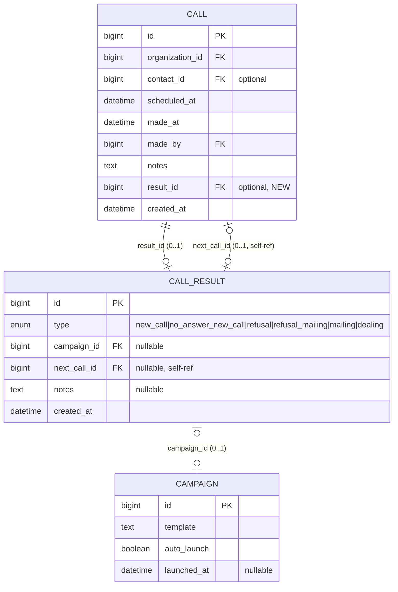

## Context

Замена комбинации полей результата (`is_deal`, `campaign_id`, `next_call_id`) на единую
сущность `CallResult` с enum-типом. Звонок хранит опциональный `result_id`. Кампания
(`Campaign`, изменение `campaign-entity`) связывается через `CallResult.campaign_id` и хранит
шаблон/вложения; отдельной сущности компании рассылок нет.

## Goals / Non-Goals

**Goals:**
- Сущность `CallResult` + enum `ResultType` (6 значений)
- `Call` теряет `is_deal`/`campaign_id`/`next_call_id`, получает `result_id`
- Динамические поля формы результата (vanilla JS)
- Проверка области доступа (`adr/0007`)
- Авто-запуск кампании при `autoLaunch` (хук; контракт с `campaign-entity`)

**Non-Goals:**
- Сессия обзвона (отдельный change)
- Запуск рассылок / отправка (сервис MailingService)
- Сущность `Campaign` — реализуется в соответствующем изменении

## Decisions

### 1. Сущность CallResult с enum-типом
**Решение**: отдельная таблица `call_result` (`id`, `type` enum, `campaign_id` FK nullable, `next_call_id` self-ref FK nullable, `notes`, `created_at`).

### 2. Опциональность результата
**Решение**: `Call.result_id` — nullable FK. Звонок без результата валиден.

### 3. Связь CallResult с Campaign
**Решение**: `CallResult.campaign_id` — nullable FK на `campaign`. Заполняется для `mailing`/`refusal_mailing`. Кампания хранит шаблон и вложения (изменение `campaign-entity`).

### 4. Динамические поля формы (vanilla JS)
**Решение**: выбор типа показывает/скрывает поля без перезагрузки (как `dashboard-search.js`).

### 5. Авто-запуск (хук)
**Решение**: при создании `CallResult` типа `mailing`/`refusal_mailing`, если `Campaign.autoLaunch` — проставить `Campaign.launchedAt`. Логика здесь; поле — в `campaign-entity`.

## ER-схема

**Удалённые поля Call**: `is_deal` (boolean), `campaign_id` (FK), `next_call_id` (self-ref FK).

## Risks / Trade-offs

- **Потеря комбинационности**: ровно один результат вместо комбинаций. Приемлемо — бизнес-процесс требует один исход.
- **Динамические поля без серверной валидации риск**: серверная валидация через Symfony Validator обязательна.
- **Пересоздание БД**: данные теряются (этап разработки); в продакшене потребуется миграция.

## Open Questions

- Внешний ID компании рассылок для интеграции — не требуется (отдельной сущности нет).
