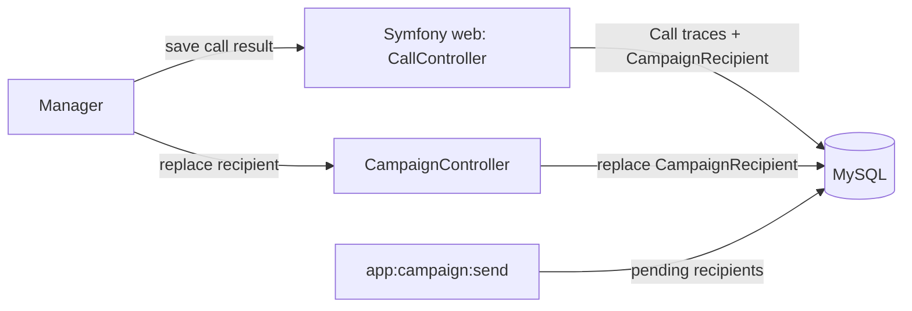
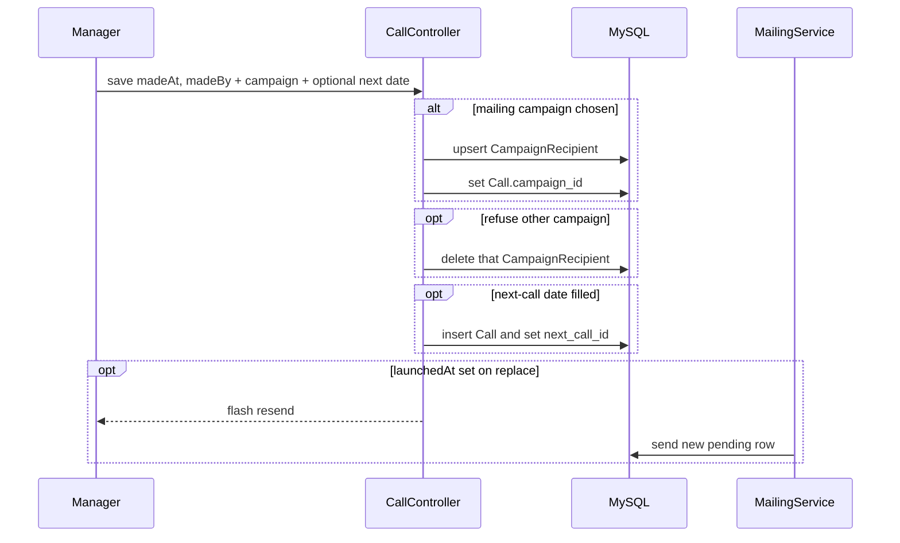

## Context

See proposal.md — Why. `Call` already has `is_deal`, unused `campaign_id` (scalar, no FK), and `next_call_id`. Recipients live on `CampaignRecipient`; `MailingService` sends only those rows. Campaigns have statuses; launch is `Campaign::launch()`, not `autoLaunch`. Forms are manual Twig + `CallController`, not Symfony Form types. Same-contact add on the recipients page is currently ignored.

## Goals / Non-Goals

**Goals:**
- Keep result data on `Call`; wire mailing/refusal to `CampaignRecipient`
- Command-style next-call date and campaign select (empty unless the user acts)
- Same-contact replace + resend when `launchedAt` is set
- Manual call form, dashboard modal, delete warning, fixtures, ADR-0004, ER

**Non-Goals:**
- `CallResult` table or result-type enum
- Auto-launch of campaigns
- Call session / launch window after a batch of calls
- Automated tests (manual checklist only)
- `forms-validation` change (draft; follow current form patterns)

## Decisions

### 1. No separate result entity
**Решение**: флаги и FK на `Call` (`is_deal`, `is_no_answer`, `campaign_id` → `Campaign` SET NULL, `next_call_id` → `Call` SET NULL).
**Почему**: у результата нет отдельного жизненного цикла; адресат и следующий звонок уже сущности.
**Альтернатива**: таблица `CallResult` — лишние каскады без выигрыша.

### 2. Actions, not a type enum
**Решение**: независимые действия; письмо + следующий звонок допустимы; отказ A + письмо B допустимы; отказ и письмо одной кампании — замена адресата (действие «рассылка» побеждает: upsert `CampaignRecipient`, отказ той же кампании отдельно не удаляет строку).
**Почему**: менеджер меняет тип письма во время звонка и всё равно планирует перезвон; отказ+письмо той же кампании — тот же replace, что и повторный выбор рассылки.
**Альтернатива**: шесть взаимоисключающих типов — запрещает нужные сочетания.

### 3. Command fields vs sticky marks
**Решение**: дата следующего звонка и выбор рассылки/отказа пустые при открытии формы, пока действие ещё не выполнено. «Сделка» и «нет ответа» — липкие чекбоксы. Если `next_call_id` уже задан, поле даты следующего звонка не показывается и не принимает новую дату; связанный звонок меняют или удаляют через его собственную форму в списке организации. Удаление связанного звонка (`ON DELETE SET NULL`) обнуляет `next_call_id`; поле даты снова появляется. Последняя кампания — контекст (ссылка), не командное поле.
**Почему**: повторное сохранение заметок не создаёт звонки и не шлёт письма.

### 4. Recipient upsert from the call
**Решение**: кампании только `ready`|`launched`. Нет строки → создать. Есть строка (любой контакт, в том числе тот же) → заменить. `launchedAt` задан → `replacementCount+1`, новый `pending`, flash. Иначе замена без счётчика и без flash о повторной отправке. Контакт адресата предвыбирается из контакта звонка.
**Почему**: потерянное письмо шлётся тем же адресатом без новой кампании.

### 5. Refusal is a membership list
**Решение**: список кампаний, где организация уже `CampaignRecipient`; удаление выбранной строки. Поля `last_refused_campaign_id` нет.
**Почему**: отказ — операция над текущим участием, не отдельный факт в истории звонка.

### 6. Delete call does not undo mailing
**Решение**: удаляется только `Call`. Адресат и порождённые звонки остаются. На «Удаление звонка» — текст и ссылка `target=_blank` на `/campaigns/{id}/recipients`, если `campaign_id` задан.

### 7. Manual controllers, not Form types
**Решение**: разметка в `call/form.html.twig`, `_edit_modal.html.twig`, `_row.html.twig`; JS в `call-modal.js`; разбор полей в `CallController`. Symfony `CallType` не вводить.

### 8. Recreate DB in development
**Решение**: миграции + обновлённые фикстуры; контейнеры можно пересоздать. Прод-данных нет.

## Architecture (C4-inspired)

Assumptions: one Symfony web app, MySQL, existing `app:campaign:send` worker. Format: Mermaid. Rigor: lightweight component + dynamic, not full C4.

## Risks / Trade-offs

- [Повторное открытие формы с пустым полем рассылки скрывает прошлый выбор] → показывать контекст «последняя рассылка» ссылкой, поле оставлять командой
- [Два канала замены адресата (звонок и страница адресатов) разъедутся] → одно правило: существующая строка = replace; flash только при `launchedAt`
- [SET NULL при удалении кампании оставляет тип действий на звонке] → в UI «рассылка удалена», если `campaign_id` пуст, а в истории нужна подпись

## Migration Plan

1. Миграция: FK `call.campaign_id` → `campaign(id)` ON DELETE SET NULL; колонка `is_no_answer`
2. Пересоздание dev-БД / контейнеров и загрузка фикстур с примерами комбинаций
3. При apply — обновить `adr/0004-interaction-model-calls.md` и `openspec/design/er.md`

## Open Questions

<!-- none -->
