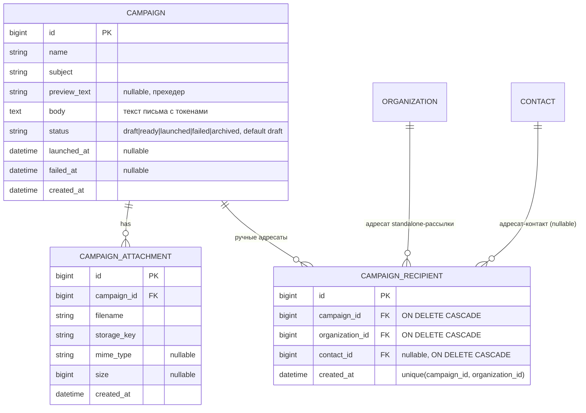

## Context

Сущность `Campaign` (кампания рассылки) выделена в отдельный функционал. Кампания
хранит тему письма, текст письма и вложения на себе. Фактическая отправка (outbox/SMTP/статусы по ADR-0010) вынесена в будущий
сервис MailingService и в этом изменении не реализуется — только статус запуска.

## Goals / Non-Goals

**Goals:**
- Расширить `Campaign`: `subject` (тема письма), `previewText` (прехедер), `body` (текст письма с токенами), `status` (enum: draft/ready/launched/failed/archived, default draft), вложения через `campaign_attachment`, ручные адресаты через `campaign_recipient`
- Контроль запуска (остановка, сброс ошибки, клонирование)

**Non-Goals:**
- Отправка писем (outbox, SMTP, статусы, отписка) — будущий сервис MailingService
- Курсы в письме — вне scope (шаблон целиком на Campaign)

## Decisions

### 1. Текст и вложения — на Campaign
**Решение**: `previewText` (прехедер, nullable), `body` (текст письма с токенами `{{greeting}}`, `{{contact_name}}`, `{{organization_name}}`) и вложения хранятся непосредственно на `Campaign`.
**Почему**: используется только email-канал; отдельная сущность компании рассылок избыточна.

### 2. Вложения через отдельную таблицу
**Решение**: `campaign_attachment` (`id`, `campaign_id` FK, `filename`, `storage_key`, `mime_type`, `size`). Файл — в файловом хранилище/object storage, в БД — метаданные и ключ.
**Почему**: нормализовано, поддержка метаданных и каскадного удаления.

### 3. Пять статусов рассылки
**Решение**: `status` (enum: `draft`/`ready`/`launched`/`failed`/`archived`, default `draft`). `draft` — черновик, редактируется; `ready` — готова к запуску, можно добавлять адресатов; `launched` — запущена (отправка будущим сервисом MailingService); `failed` — ошибка при отправке (сбрасывается в `ready`); `archived` — архивная (в списке всегда внизу, greyout). `launchedAt` фиксируется при переходе в `launched`; `failedAt` фиксируется при переходе в `failed`.
**Почему**: полный жизненный цикл рассылки; `failed` нужен для обработки ошибок отправки; `archived` — для хранения завершённых кампаний.

### 4. Остановка и сброс ошибки
**Решение**: `launched` → `ready` (остановка, кнопка ■ на карточке и в списке). `failed` → `ready` (сброс, кнопка «Сбросить» на карточке). После сброса становится доступна кнопка «Запустить».
**Почему**: позволяет повторно запускать рассылку после остановки или ошибки.

### 5. Ручные адресаты standalone-рассылок — таблица `campaign_recipient`
**Решение**: ручной выбор организаций адресатами хранится в `campaign_recipient` (`campaign_id`, `organization_id` UNIQUE, `contact_id` (nullable), оба FK `ON DELETE CASCADE`). Уникальный индекс на `(campaign_id, organization_id)` гарантирует одно письмо на организацию. Если указан `contact_id`, письмо отправляется на email контакта; иначе — на организацию. При замене (org-level → contact-level или наоборот) старая запись удаляется, новая добавляется (страница подтверждения). Менеджеру разрешено добавлять только организации своей области доступа (ADR-0007, отказ 403), администратору — любые (ADR-0008). Адресаты добавляются только для кампаний со статусом `ready` или `launched`.
**Почему**: сценарий «Менеджер не может добавить недоступную организацию адресатом» требует отклонять запрос на этапе выбора; contact_id позволяет направить рассылку конкретному контакту по email. Уникальный индекс `(campaign_id, organization_id)` гарантирует, что одно и то же сочетание не добавляется дважды; при попытке замены (org-level) выводится страница подтверждения с удалением старой и добавлением новой записи.

### 6. Клонирование кампаний
**Решение**: статический метод `Campaign::cloneFrom(source, withRecipients)` создаёт новую кампанию со статусом `draft`, копируя тему, превью, текст. Имя получает суффикс « (копия)». Вложения копируются как ссылки в `campaign_attachment` (метаданные + storage key), но файлы в storage НЕ дублируются — один файл может быть привязан к нескольким кампаниям. Получатели копируются опционально (флаг `with_recipients`). Доступно только для кампаний со статусом не `draft`.
**Почему**: повторное использование шаблона кампании и вложений без дублирования файлов в storage.

### 7. Визуальные индикаторы и сортировка
**Решение**: в списке рассылок три колонки — Название (с кнопками быстрых действий ▶/■/✕), Статус, Тема письма. Сортировка по всем трём колонкам через клик по заголовку. Архивные всегда внизу. Строки failed имеют красную подсветку фона; archived — greyout.
**Почему**: визуальная навигация по статусам рассылок; быстрые действия позволяют запускать/останавливать без входа в карточку.

## ER-схема

## Risks / Trade-offs

- **Только email**: если позже потребуется push/SMS, модель придётся расширять (полиморфный канал/провайдер). Пока избыточность неоправдана.

## Open Questions

- **Решено**: добавлен отдельный `status` (enum: `draft`/`ready`/`launched`/`failed`/`archived`). `launched_at` сохраняется как временная метка запуска; `status` — источник истины для состояния рассылки (по умолчанию `draft`, `ready` — можно добавлять получателей, при запуске → `launched`, `failed` — ошибка отправки, `archived` — завершённая кампания).
