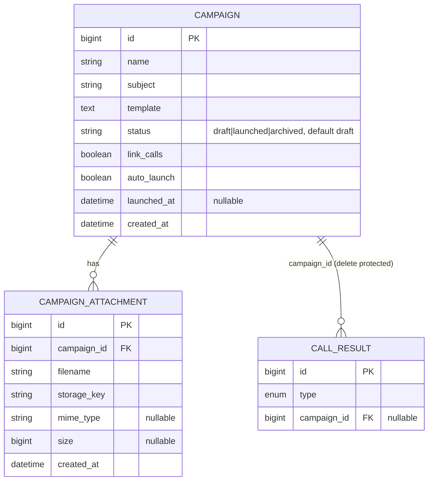

## Context

Сущность `Campaign` (кампания рассылки) выделена в отдельный функционал. Кампания
хранит тему письма, шаблон письма и вложения на себе (отдельная
сущность «компания рассылок» / провайдер / канал доставки не создаётся — используется
только email-канал), связывается со звонками через `CallResult`, и поддерживает запуск
(ручной/авто). Фактическая отправка (outbox/SMTP/статусы по ADR-0010) вынесена в будущий
сервис MailingService и в этом изменении не реализуется — только флаг/статус запуска.

## Goals / Non-Goals

**Goals:**
- Расширить `Campaign`: `subject` (тема письма), `template` (текст), `status` (enum: draft/launched/archived, default draft), вложения через `campaign_attachment`, `link_calls`, `auto_launch`, `launched_at`
- Связь со звонками через `CallResult` (delete-protection)
- Ручной и авто-запуск (флаг/статус)

**Non-Goals:**
- Отправка писем (outbox, SMTP, статусы, отписка) — будущий сервис MailingService
- Отдельная сущность «компания рассылок» / провайдер / канал доставки — не создаётся
- Курсы в письме — вне scope (шаблон целиком на Campaign)
- Полиморфные каналы доставки (push) — не рассматриваются (используется только email)

## Decisions

### 1. Шаблон и вложения — на Campaign
**Решение**: `template` (текст) и вложения хранятся непосредственно на `Campaign`.
**Почему**: используется только email-канал; отдельная сущность компании рассылок избыточна.

### 2. Вложения через отдельную таблицу
**Решение**: `campaign_attachment` (`id`, `campaign_id` FK, `filename`, `storage_key`, `mime_type`, `size`). Файл — в файловом хранилище/object storage, в БД — метаданные и ключ.
**Почему**: нормализовано, поддержка метаданных и каскадного удаления.

### 3. Защита от удаления через CallResult
**Решение**: удаление Campaign запрещено, если существует хотя бы один `CallResult` с `campaign_id`. Проверка в сервисе/контроллере.
**Почему**: сохраняется целостность истории обзвона.

### 4. Запуск — только флаг/статус
**Решение**: `launched_at` (nullable) + отдельный `status` (enum draft/launched/archived). Ручной запуск = заполнить `launched_at` и выставить `status = launched`. Авто-запуск = хук при создании `CallResult` типа mailing/refusal_mailing с `auto_launch=true` (также `status = launched`).
**Почему**: фиксируем намерение запуска; отправка — отдельный модуль.

## ER-схема

## Risks / Trade-offs

- **Только email**: если позже потребуется push/SMS, модель придётся расширять (полиморфный канал/провайдер). Пока избыточность неоправдана.
- **Авто-запуск без отправки**: флаг проставляется, но письма не уходят, пока не реализован сервис MailingService.

## Open Questions

- **Решено**: добавлен отдельный `status` (enum: `draft`/`launched`/`archived`). `launched_at` сохраняется как временная метка запуска; `status` — источник истины для состояния рассылки (по умолчанию `draft`, при запуске → `launched`, `archived` зарезервирован для будущего архивирования).
